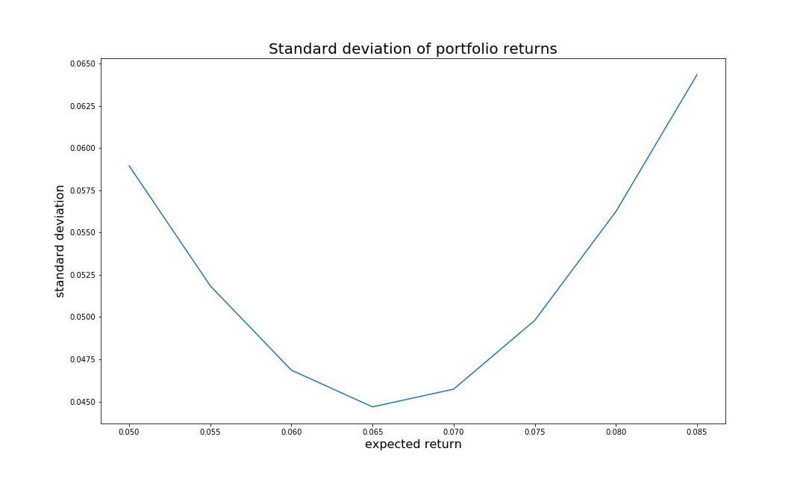

# Markowitz Portfolio Optimization Demo

A quick demonstration of Markowitz portfolio optimization.

This optimization method takes as input a list of assets along with their expected returns and covariance matrix to produce asset allocation for the minimum variance portfolio.

## Demonstration

The code in this repository can be used to demonstrate Markowitz portfolio optimization using any number of assets. For simplicity, an example is included using three assets and the following inputs:

1. A vector of expected returns for each asset

   
2. A matrix with the covariances of the assets

   
3. A vector of expected returns for the overall portfolio:

   

Several functions have been written to produce the following outputs:

1. `calc_portfolio` returns a pandas DataFrame containing the details of the portfolio:

         mu   std_dev   tot_var        w0        w1        w2
         0  0.050  0.058479  0.003420 -0.179321  1.072694  0.106627
         1  0.055  0.054598  0.002981 -0.095457  0.926546  0.168910
         2  0.060  0.052439  0.002750 -0.011593  0.780399  0.231194
         3  0.065  0.052215  0.002726  0.072271  0.634251  0.293478
         4  0.070  0.053951  0.002911  0.156135  0.488103  0.355761
         5  0.075  0.057469  0.003303  0.239999  0.341956  0.418045
         6  0.080  0.062468  0.003902  0.323863  0.195808  0.480328
         7  0.085  0.068627  0.004710  0.407727  0.049661  0.542612

2. `plot_asset_allocation` plots the weights of each portfolio along with a red vertical line to indicate the minimum variance portfolio:

   
3. `plot_risk` plots the standard deviation of each portfolio to show which is the lowest risk portfolio:

   
## How to use this code

Clone this repository or download it manually. From here you can:
1. Run the `portfolio-optimization.py` directly to produce the sample output described above.
2. Import the functions into your own script and use them. For example, you can show the benefits of diversification like I tried in ``Diversification.ipynb``.
